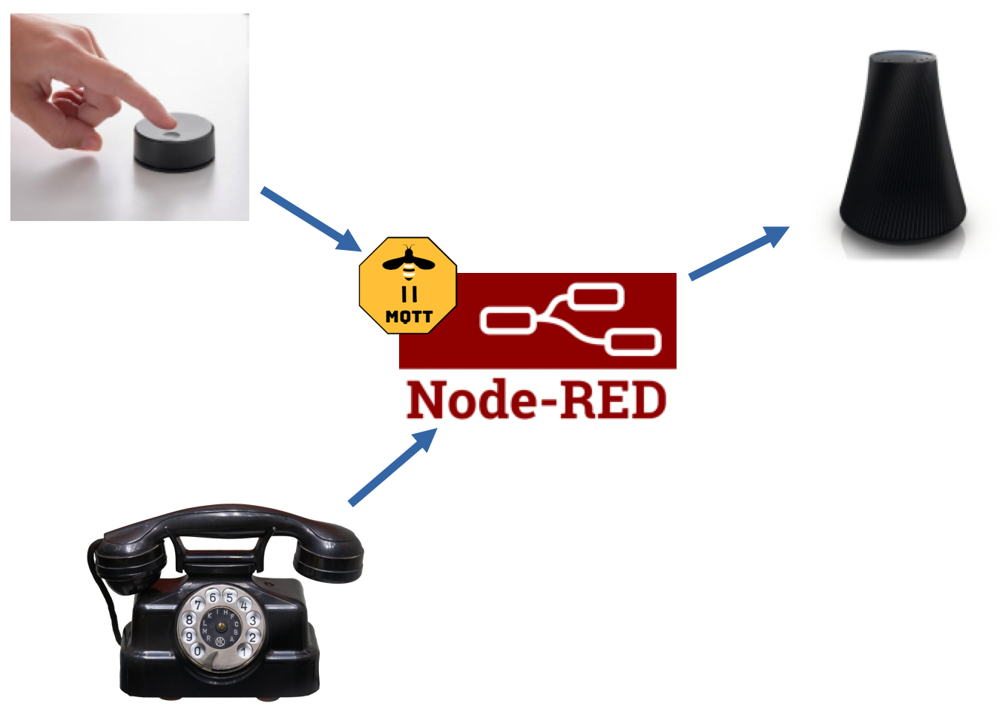
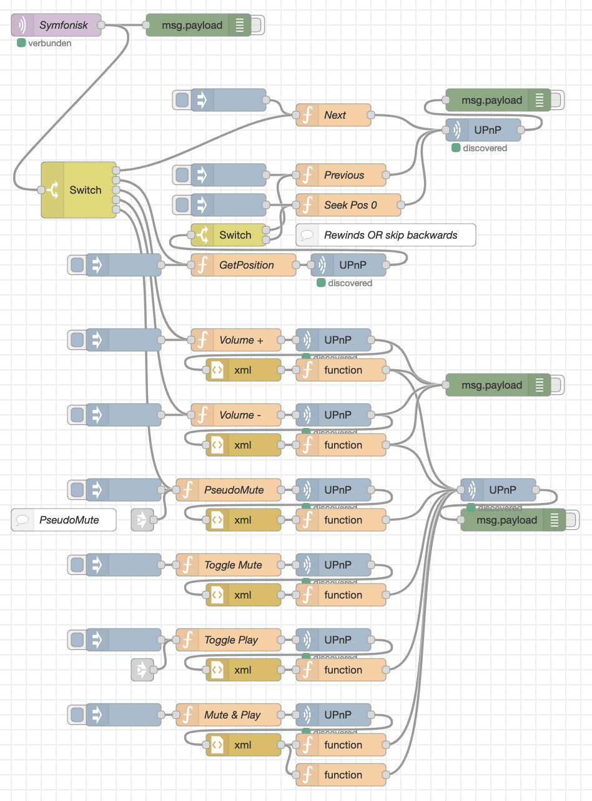
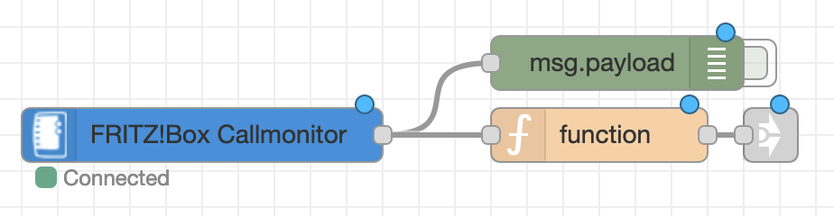

# Node-Red UPnP Control with Ikea Symfonisk
Integrate DLNA music player into and control them through smart home running Node-Red using IKEA's Symphonisk remote control dial button.  In addition the music gets muted on incoming or outgoing phone calls (AVM Fritzbox needed).

## Setup prerequisites
This whole approach is based on 'node-red-contrib-upnp', even though it's *not available ready-to-use* from within node-red add-on repo.

If you running node-red in docker (like so https://github.com/ct-Open-Source/ct-Smart-Home), you might use the following commands to achieve upnp installing:

1. `docker exec -it ct-smart-home_nodered_1 bash`
1. `git clone https://github.com/cinhcet/node-red-contrib-upnp.git`
1. `npm install node-red-contrib-upnp`

Sadly this needs to be done after each and every update of the docker container.

## The two flows

Below is the little snippet to mute the music when recieving or initiating phone calls:

It contains multiple possible behaviors for toggle (single click).  Just change the link to the one you want to have.
